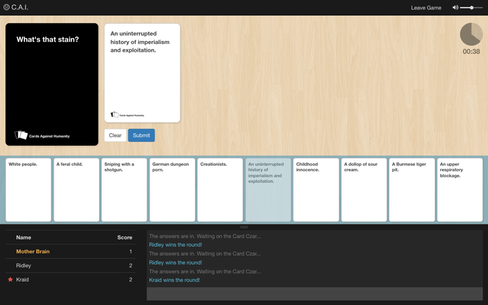

Cards Against Idiots
===

An unnecessary Cards Against Humanity clone. Allows you to use your own [Cardcast](https://www.cardcastgame.com/) decks.

## Requirements

[Node](https://nodejs.org/) (4.6 or later), [Bower](https://bower.io/), [Gulp](http://gulpjs.com/)

## Heroku Deployment

## Installation

1. Clone Git repo
2. Install dependencies and build with gulp `npm run build`
3. Rename `.env.example` to `.env` and update environment-specific variables (see below)
4. Start the server `npm start`

## Configuration

The `.env` file in the root directory stores environment-specific variables in the format `NAME=VALUE`.

Variable    | Default   | Description
----------- | --------- | -----------
PORT        | 8080      | Port number for the server to listen on
CACHE_TIME  | 600       | Time to cache CardCast decks (in seconds) before retreiving a fresh version from the CardCast API.
DB_TYPE     | json      | Datbase type. Can be set to `json` (default), `mongodb`, or `mysql`.
DB_HOST     |           | 
DB_PORT     |           | 
DB_NAME     |           | 
DB_USER     |           | 
DB_PASSWORD |           | 

## Managing Decks

### JSON Files
The decks directory is scanned each time the server starts, and includes the Cards Against Humanity base deck as well as the first five expansions. To add additional decks to your game, copy your deck.json file to the decks directory and restart the server. Decks must be valid JSON documents and should follow the format of the included decks.

### MySql & MongoDB
Database dumps for MySql and MongoDB are included in the dumps directory. Use the command line or your favorite GUI tool to import and add your own decks.

